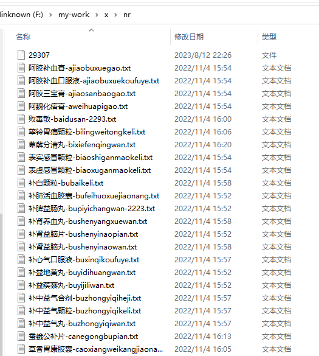

# epachong
一个中草药爬虫案例 -基于易语言
**该项目是由于亲戚朋友的委托编写，抓取 https://m.xjlz365.com 站点上的所有中草药信息，包括疗效等其他草药信息，最终存入简单的txt文本文件中。**
****
## 实现方法  
1：需要在运行目录下新建data、nr两个文件夹存放抓取结果。  
2：运行前建议关闭360后再运行。  
3：确保type.txt文件的存在和文件内容含有分类。  
****
## 要点：  
温馨提示：爬虫请合理使用，禁止用于干坏事。  
****
## 其他说明： 
type.txt存放的是网站首页展示的所有方剂分类名。一行一个，每行用|隔开，如anshenfang/安神方吧，表示这是一个名为安神方的分类。anshenfang是其代号或者拼音拼写。  
data目录存放的是是点击进入分类页的所有药方名称列表信息。如我们点击“安神方”。链接为 https://m.xjlz365.com/zyg/fangji/anshenfang/ 则可看到所有药方名称，由于该分类下的药方列表有多页，所有文件名尾部用_X表示页数  
nr目录存放的是进入某药方的信息，目前取得的信息是药房成分和图片URL。如果需要扩展也可以获得页面上的其他信息（如药方来源、主治、用法等）。  
数据存取非SQL。txt简易模式。  
数据统计：139个大药剂分类，350页药方，总计大约9500个药方  
****
## 效果图：  
我成功跑起来了，并抓取到了很多中草药和药方：  

